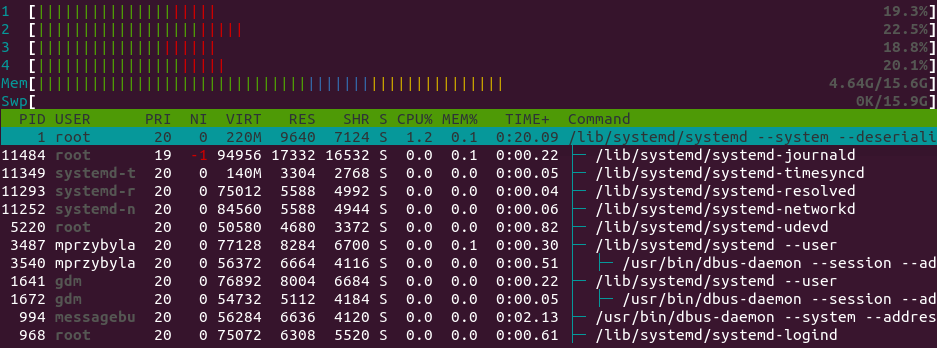

# Czym jest systemd?

`systemd` to menedżer procesów działających w przestrzeni użytkownika (ang. User Space) Linuksa. Jest uruchamiany przez kernel jako pierwszy proces, dlatego posiada `PID=1`. Wszystkie inne procesy działające w systemie są jego pochodnymi (dziećmi). `systemd` jest odpowiedzialny za ich uruchamianie, doglądanie oraz terminowanie w kolejności zgodnej z konfiguracją. `systemd` stawia na możliwie duże zrównoleglenie procesu uruchamiania systemu.

`systemd` może działać w wielu instancjach (sesjach) jednocześnie, jednak `PID=1` ma zawsze tzw. sesja systemowa. Pozostałe sesje to tzw. sesje użytkownika. Takie zachowanie widać na poniższym zrzucie ekranu z `htop`.

Konfiguracje obu rodzajów sesji znajdują się odpowiednio w plikach `/etc/systemd/system.conf` oraz `/etc/systemd/user.conf`. Można za ich pomocą ustawić domyślne zmienne środowiskowe, poziom logowania, limity zasobów itp.

Procesy, uruchamiane przez `systemd`, konfiguruje się poprzez definiowanie tzw. `unitów`. `unity` to pliki tekstowe, zawierające informacje o tym co i jak ma zostać uruchomione. Dla sesji systemowej, `systemd` odszukuje tych plików m.in. w katalogach:

- `/usr/lib/systemd/system/`,
- `/run/systemd/system/`,
- `/etc/systemd/system/`.

Dla sesji użytkownika, są to m.in.

- `/usr/lib/systemd/user/`,
- `/run/systemd/user/`,
- `/etc/systemd/user/`,
- `~/.config/systemd/user/`.

(Uwaga: w Ubuntu używane są też katalogi `/lib/systemd/system/`.) W obu przypadkach katalogi zostały wymienione z rosnącym priorytetem, tzn. jeżeli w dwóch z podanych katalogów danego typu sesji znajdują się `unity` o takiej samej nazwie, `systemd` skorzysta z tego o największym priorytecie. Dodatkowo, możliwe jest zdefiniowanie zmiennej środowiskowej `$SYSTEMD_UNIT_PATH` tak, aby wskazywała na własne katalogi, w których `systemd` ma odszukiwać `unitów`. Bardziej kompletny spis wykorzystywanych przez `systemd` katalogów znajduje się w [dokumentacji](https://www.freedesktop.org/software/systemd/man/systemd.unit.html#Unit%20File%20Load%20Path).

Zanim przejdziemy do konfigurowania własnych `unitów`, zapoznajmy się z ważnym narzędziem jakim jest `systemctl`.
